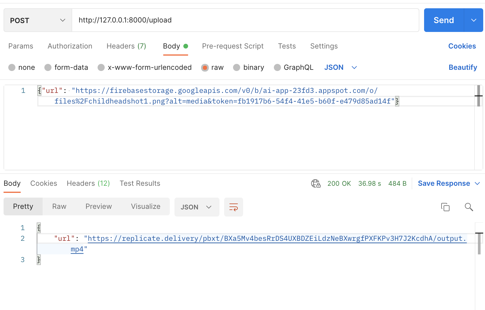

# 49795-Team3

## Backend
Prerequisite: Python installed, version 3.8.2 or newer
Activate environment with: 
```
cd backend
source env/bin/activate
```
Run the flask app (API) with: 
```
cd backend
flask --app api run
```
The flask app runs locally on the following url & port: http://127.0.0.1:5000

Test the API with postman

## Frontend
Prerequisite: npm installed
Run frontend with 
```
cd app-frontend
npm start
```
